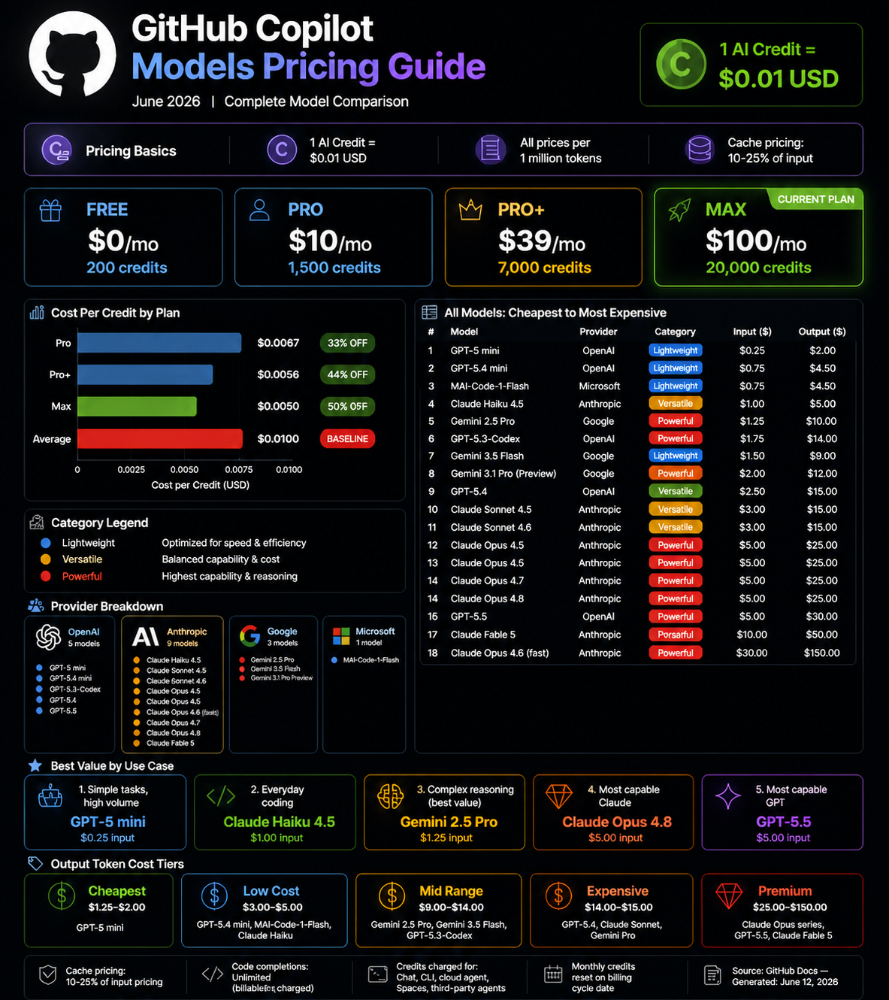

# GitHub Copilot Models: Complete Pricing Guide

**Last Updated:** June 12, 2026  
**Current Plan:** ⭐ Copilot Max
**Source:** [GitHub Docs - Models and Pricing](https://docs.github.com/copilot/reference/copilot-billing/models-and-pricing)

---

## Pricing Basics

- **1 AI Credit = $0.01 USD**
- **All prices below are per 1 million tokens**
- **Cache pricing is typically 10-25% of input pricing**

---

## Models Sorted by Cost (Cheapest → Most Expensive)

| Rank | Model | Provider | Category | Input ($) | Input (Credits) | Cache ($) | Cache (Credits) | Output ($) | Output (Credits) |
| --- | --- | --- | --- | --- | --- | --- | --- | --- | --- |
| 1 | **GPT-5 mini** | OpenAI | Lightweight | $0.25 | 25 | $0.02 | 2 | $2.00 | 200 |
| 2 | **GPT-5.4 mini** | OpenAI | Lightweight | $0.75 | 75 | $0.07 | 7 | $4.50 | 450 |
| 3 | **MAI-Code-1-Flash** | Microsoft | Lightweight | $0.75 | 75 | $0.07 | 7 | $4.50 | 450 |
| 4 | **Claude Haiku 4.5** | Anthropic | Versatile | $1.00 | 100 | $0.10 | 10 | $5.00 | 500 |
| 5 | **Gemini 2.5 Pro** | Google | Powerful | $1.25 | 125 | $0.12 | 12 | $10.00 | 1000 |
| 6 | **Gemini 3.5 Flash** | Google | Lightweight | $1.50 | 150 | $0.15 | 15 | $9.00 | 900 |
| 7 | **GPT-5.3-Codex** | OpenAI | Powerful | $1.75 | 175 | $0.17 | 17 | $14.00 | 1400 |
| 8 | **Gemini 3.1 Pro (Preview)** | Google | Powerful | $2.00 | 200 | $0.20 | 20 | $12.00 | 1200 |
| 9 | **GPT-5.4** | OpenAI | Versatile | $2.50 | 250 | $0.25 | 25 | $15.00 | 1500 |
| 10 | **Claude Sonnet 4.5** | Anthropic | Versatile | $3.00 | 300 | $0.30 | 30 | $15.00 | 1500 |
| 11 | **Claude Sonnet 4.6** | Anthropic | Versatile | $3.00 | 300 | $0.30 | 30 | $15.00 | 1500 |
| 12 | **Claude Opus 4.5** | Anthropic | Powerful | $5.00 | 500 | $0.50 | 50 | $25.00 | 2500 |
| 13 | **Claude Opus 4.6** | Anthropic | Powerful | $5.00 | 500 | $0.50 | 50 | $25.00 | 2500 |
| 14 | **Claude Opus 4.7** | Anthropic | Powerful | $5.00 | 500 | $0.50 | 50 | $25.00 | 2500 |
| 15 | **Claude Opus 4.8** | Anthropic | Powerful | $5.00 | 500 | $0.50 | 50 | $25.00 | 2500 |
| 16 | **GPT-5.5** | OpenAI | Powerful | $5.00 | 500 | $0.50 | 50 | $30.00 | 3000 |
| 17 | **Claude Fable 5** | Anthropic | Powerful | $10.00 | 1000 | $1.00 | 100 | $50.00 | 5000 |
| 18 | **Claude Opus 4.6 (fast mode) (Preview)** | Anthropic | Powerful | $30.00 | 3000 | $3.00 | 300 | $150.00 | 15000 |

---

## Models Grouped by Provider

### Anthropic (Claude)

| Model | Category | Input ($) | Cache ($) | Output ($) | Best For |
| --- | --- | --- | --- | --- | --- |
| Claude Opus 4.5 | Powerful | $5.00 | $0.50 | $25.00 | Complex reasoning |
| Claude Opus 4.6 | Powerful | $5.00 | $0.50 | $25.00 | Complex reasoning |
| Claude Opus 4.7 | Powerful | $5.00 | $0.50 | $25.00 | Complex reasoning |
| Claude Opus 4.8 | Powerful | $5.00 | $0.50 | $25.00 | Most capable Claude |
| Claude Fable 5 | Powerful | $10.00 | $1.00 | $50.00 | Premium frontier reasoning |
| Claude Opus 4.6 (fast mode) (Preview) | Powerful | $30.00 | $3.00 | $150.00 | Ultra-fast, higher cost preview |
| Claude Haiku 4.5 | Versatile | $1.00 | $0.10 | $5.00 | Fast, everyday coding |
| Claude Sonnet 4.5 | Versatile | $3.00 | $0.30 | $15.00 | Balanced performance |
| Claude Sonnet 4.6 | Versatile | $3.00 | $0.30 | $15.00 | Balanced performance |

### OpenAI (GPT)

| Model | Category | Input ($) | Cache ($) | Output ($) | Best For |
| --- | --- | --- | --- | --- | --- |
| GPT-5 mini | Lightweight | $0.25 | $0.02 | $2.00 | Fast, low cost |
| GPT-5.4 mini | Lightweight | $0.75 | $0.07 | $4.50 | Efficient coding |
| GPT-5.3-Codex | Powerful | $1.75 | $0.17 | $14.00 | Code generation |
| GPT-5.5 | Powerful | $5.00 | $0.50 | $30.00 | Most capable GPT |
| GPT-5.4 | Versatile | $2.50 | $0.25 | $15.00 | General purpose |

### Google (Gemini)

| Model | Category | Input ($) | Cache ($) | Output ($) | Best For |
| --- | --- | --- | --- | --- | --- |
| Gemini 3.5 Flash | Lightweight | $1.50 | $0.15 | $9.00 | Modern, efficient |
| Gemini 2.5 Pro | Powerful | $1.25 | $0.12 | $10.00 | Best value powerful model |
| Gemini 3.1 Pro (Preview) | Powerful | $2.00 | $0.20 | $12.00 | Complex tasks (preview) |

### Microsoft (MAI)

| Model | Category | Input ($) | Cache ($) | Output ($) | Best For |
| --- | --- | --- | --- | --- | --- |
| MAI-Code-1-Flash | Lightweight | $0.75 | $0.07 | $4.50 | Fast, low-cost code tasks |

---

## Copilot Plans Comparison

| Plan             | Price/Month | Base Credits | Flex Allotment | Total Credits        |
| ---------------- | ----------- | ------------ | -------------- | -------------------- |
| **Copilot Free** | $0          | —            | —              | 200 (limited models) |
| **Copilot Pro**  | $10         | 1,000        | 500            | 1,500                |
| **Copilot Pro+** | $39         | 3,900        | 3,100          | 7,000                |
| **Copilot Max**  | $100        | 10,000       | 10,000         | 20,000               |

---

## Cost Per Credit by Plan

| Plan        | Monthly Cost | Total Credits | Cost Per Credit | Discount vs. Overage |
| ----------- | ------------ | ------------- | --------------- | -------------------- |
| **Pro**     | $10          | 1,500         | $0.0067         | 33% cheaper          |
| **Pro+**    | $39          | 7,000         | $0.0056         | 44% cheaper          |
| **Max**     | $100         | 20,000        | $0.0050         | 50% cheaper          |
| **Overage** | —            | —             | $0.0100         | Baseline             |

---

## Best Value Recommendations

| Use Case | Recommended Model | Why |
| --- | --- | --- |
| Cheapest everyday chat | GPT-5 mini | Lowest input/output cost in the VS Code list |
| Efficient coding | GPT-5.4 mini | Low cost with strong coding performance |
| Fast code tasks (alt) | MAI-Code-1-Flash | Microsoft lightweight code model |
| Complex reasoning (best value) | Gemini 2.5 Pro | Strong capability at moderate cost |
| Most capable Claude | Claude Opus 4.8 | Top-tier reasoning |
| Most capable GPT | GPT-5.5 | Highest-tier GPT in the list |
| Premium frontier work | Claude Fable 5 | Premium tier pricing and capability |

---

## Quick Reference: Output Token Cost Comparison

| Tier | Models (from your VS Code list) | Output Cost Range |
| --- | --- | --- |
| Low Cost | GPT-5 mini | $2.00 |
| Low–Mid | GPT-5.4 mini, MAI-Code-1-Flash, Claude Haiku 4.5 | $4.50 – $5.00 |
| Mid | Gemini 3.5 Flash, Gemini 2.5 Pro, Gemini 3.1 Pro (Preview) | $9.00 – $12.00 |
| Expensive | GPT-5.3-Codex, GPT-5.4, Claude Sonnet 4.5, Claude Sonnet 4.6 | $14.00 – $15.00 |
| Premium | Claude Opus 4.5/4.6/4.7/4.8, GPT-5.5, Claude Fable 5 | $25.00 – $50.00 |
| Ultra Premium (Preview) | Claude Opus 4.6 (fast mode) (Preview) | $150.00 |

---

## Notes

- **Cache pricing** is typically 10-25% of input pricing for most models
- **Code completions** and **next edit suggestions** are unlimited (no credits charged)
- **Credits are charged for:** Copilot Chat, CLI, cloud agent, Spaces, and third-party agents
- **Monthly credits reset** on your billing cycle date

---

_Generated on June 1, 2026_
