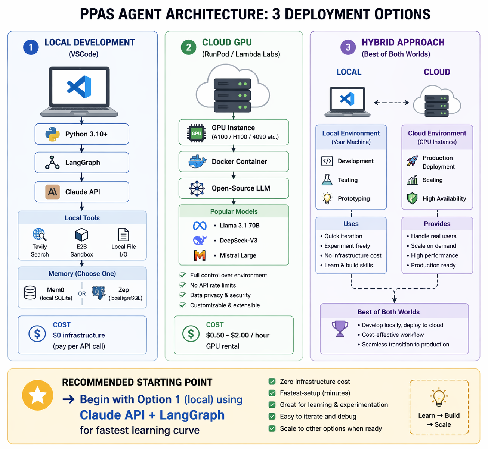
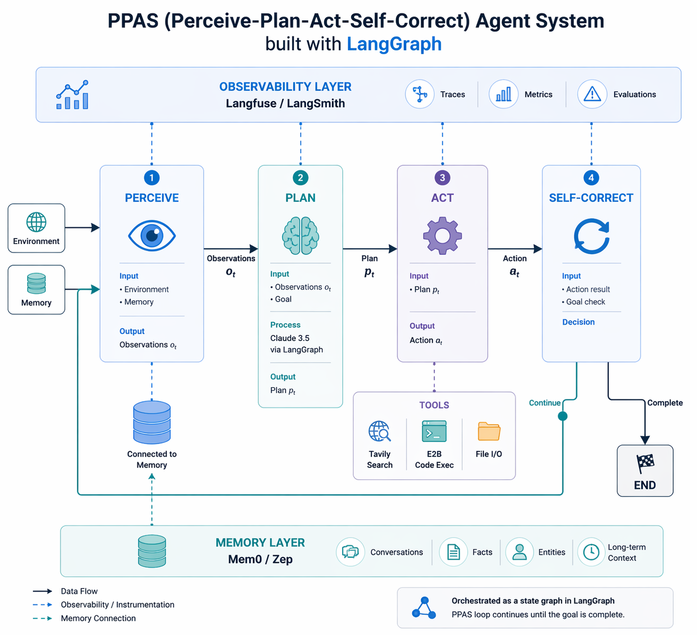

# Agentic AI — Development Environment

**Paper:** Perceive, Plan, Act, Self-Correct (DOI: 10.31224/6738)
**Purpose:** Runnable implementations of every concept in the paper — from raw API calls to production multi-agent systems.

---

## Quick Start (5 minutes)

```bash
# 1. Open this folder in VS Code
cd /g/Developments/artificial_intelligence_development/ai_systems_landscape_2026/publications/01-agentic-ai/dev

# 2. Create Python virtual environment
python -m venv .venv
.venv/Scripts/activate          # Windows Bash
# source .venv/bin/activate     # macOS/Linux

# 3. Install dependencies
pip install -r shared/requirements.txt

# 4. Set up API keys
copy shared\config\.env.example shared\config\.env
# Edit shared/config/.env and add your OPENAI_API_KEY

# 5. Run the core PPAS loop (the paper's central concept)
python phase-1-foundations/03-agent-loop-scratch/01_ppas_loop.py
```

---

## Visual Guide — PPAS Architecture and Workflow

### PPAS Agent Structure (Architecture)



This diagram shows the static architecture: external inputs, the PPAS core loop (Perceive, Plan, Act, Self-Correct), support services (LLM runtime, memory, tools), and production layers (guardrails + observability).

### PPAS Agent Implementation (Runtime Workflow)



This workflow maps directly to `phase-1-foundations/03-agent-loop-scratch/01_ppas_loop.py`: initialize state, run perceive/plan, execute tool calls, self-correct, loop until completion, then return the final answer.

---

## Folder Structure

```
dev/
├── shared/                                ← shared across all phases
│   ├── config/
│   │   └── .env.example                  ← copy to .env, fill in API keys
│   ├── requirements.txt                  ← all dependencies
│   └── utils/
│       └── llm_client.py                 ← LLM client helper
│
├── phase-1-foundations/                  ← Weeks 1–3: raw APIs + the loop
│   ├── 01-llm-api-basics/
│   │   ├── 01_openai_basic.py            ← 4 OpenAI patterns
│   │   └── 02_anthropic_basic.py         ← Claude API comparison
│   ├── 02-prompt-engineering/
│   │   ├── 01_chain_of_thought.py        ← direct vs CoT vs zero-shot CoT
│   │   └── 02_structured_output.py       ← Pydantic + response_format
│   └── 03-agent-loop-scratch/
│       └── 01_ppas_loop.py               ★ THE CORE — PPAS loop, no framework
│
├── phase-2-agent-core/                   ← Weeks 4–6: real frameworks
│   ├── 01-langgraph-react/
│   │   └── 01_react_agent.py             ★ same loop, now with LangGraph
│   ├── 02-tool-integration/
│   │   └── 01_tool_calling.py            ← web search + parallel tool calls
│   ├── 03-memory-systems/
│   │   └── 01_working_memory.py          ← working + short-term memory
│   └── 04-planning-reflection/
│       └── 01_tree_of_thought.py         ← ToT: generate → evaluate → execute
│
├── phase-3-multi-agent/                  ← Weeks 7–9: topology + protocols
│   ├── 01-supervisor-topology/
│   │   └── 01_supervisor.py              ← research + analyst + writer agents
│   ├── 02-swarm-topology/
│   │   └── 01_swarm.py                   ← peer-to-peer agent handoffs
│   ├── 03-mcp-server/
│   │   └── 01_mcp_server.py              ← MCP server with 3 tools
│   ├── 04-a2a-protocol/
│   │   └── 01_a2a_basic.py               ← Agent Cards + task delegation
│   └── 05-human-in-the-loop/
│       └── 01_hitl.py                    ← LangGraph interrupt() + approval gate
│
├── phase-4-productionize/                ← Weeks 10–12: obs, safety, eval
│   ├── 01-observability/
│   │   └── 01_langsmith_setup.py         ← LangSmith tracing
│   ├── 02-guardrails/
│   │   └── 01_input_validation.py        ← injection, PII, budget, LLM checks
│   └── 03-benchmark-eval/
│       └── 01_benchmark_intro.py         ← SWE-Bench/GAIA overview + micro-bench
│
└── phase-5-experiments/                  ← Week 13+: paper §8 validation
    ├── 01-benchmark-results/             ← output JSON files land here
    └── 02-case-studies/                  ← production agent case study scripts
```

---

## Start Here (recommended order)

| Step | File                                                | What You Learn               |
| ---- | --------------------------------------------------- | ---------------------------- |
| 1    | `phase-1/01-llm-api-basics/01_openai_basic.py`    | How to call an LLM           |
| 2    | `phase-1/03-agent-loop-scratch/01_ppas_loop.py`   | **The core PPAS loop** |
| 3    | `phase-2/01-langgraph-react/01_react_agent.py`    | Same loop with a framework   |
| 4    | `phase-2/03-memory-systems/01_working_memory.py`  | How agent memory works       |
| 5    | `phase-3/01-supervisor-topology/01_supervisor.py` | Multi-agent coordination     |
| 6    | `phase-3/03-mcp-server/01_mcp_server.py`          | MCP protocol                 |
| 7    | `phase-4/02-guardrails/01_input_validation.py`    | Safety guardrails            |
| 8    | `phase-4/03-benchmark-eval/01_benchmark_intro.py` | Evaluating agents            |

---

## Do You Need a GPU?

**No.** All files in Phases 1–4 call hosted LLM APIs (OpenAI, Anthropic, Google).
Your local machine is sufficient.

You only need cloud GPU when:

- Running local models (Llama 3, Mistral) via Ollama
- Reproducing full SWE-Bench or WebArena runs (Phase 5)
- Fine-tuning (not covered here)

For Phase 5 experiments: Lambda Labs A100 at ~$0.50/hr is sufficient.

---

## VS Code Extensions (install once)

- `ms-python.python` — Python + IntelliSense
- `ms-toolsai.jupyter` — Jupyter notebooks inside VS Code
- `ms-python.debugpy` — step-through debugging of agent loops
- `github.copilot` — AI pair programming
