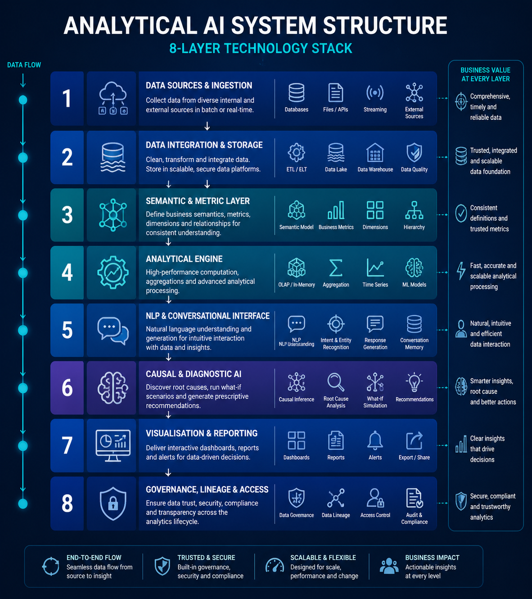
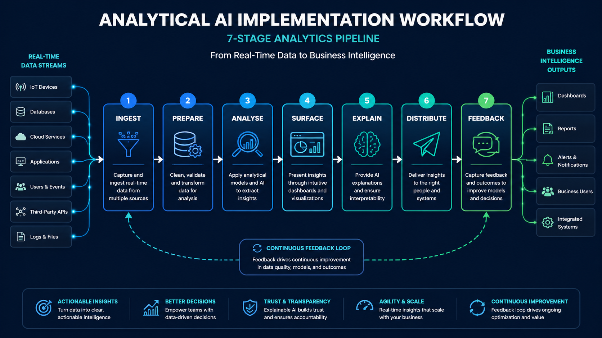

# Analytical AI — Reference Implementation

### 5-Phase Development Workspace · Paper §2–9 Coverage

> **Paper**: Mahdi, H. (2026). _Causal Inference at Scale: Architectural Patterns for Analytical AI Systems in Enterprise Business Intelligence_. SSRN Preprint. CC BY 4.0.

This workspace provides a complete, runnable implementation of every concept from the paper — from raw data ingestion through causal inference, NL2SQL, and production BI system assembly. No GPU required. OpenAI key optional.

---

## System Structure



_8-Layer Technology Stack · 7-Stage Analytics Pipeline · Core Engine Components_

---

## Implementation Workflow



_Runtime Data Flow · Phase-by-Phase Development Path · Paper §2–9 Coverage_

---

## Quick Start

```bash
# 0. Change to the dev/ directory (required for all commands below)
cd G:/Developments/artificial_intelligence_development/ai_systems_landscape_2026/publications/02-analytical-ai/dev

# 1. Create and activate virtual environment
python -m venv .venv
# Windows:
.venv\Scripts\activate
# macOS / Linux:
source .venv/bin/activate

# 2. Install all dependencies
pip install -r shared/requirements.txt

# 3. Configure environment (optional — needed for NL2SQL LLM calls)
cp shared/config/.env.example shared/config/.env
# Then edit shared/config/.env and add your OPENAI_API_KEY

# 4. Run the full end-to-end BI system
python phase-5-experiments/02-case-studies/01_end_to_end_bi_system.py

# 5. Run the benchmark suite
python phase-5-experiments/01-benchmark-results/run_benchmarks.py
```

---

## Learning Order

| Step | File                                                                        | What You Learn                                               |
| ---- | --------------------------------------------------------------------------- | ------------------------------------------------------------ |
| 1    | `phase-1-foundations/01-data-pipeline/01_ingest_prepare.py`                 | CSV → DuckDB OLAP, schema validation, semantic layer metrics |
| 2    | `phase-1-foundations/02-statistical-analysis/01_descriptive_inferential.py` | Descriptive stats, Welch t-test, Mann-Whitney U A/B testing  |
| 3    | `phase-1-foundations/03-full-pipeline/01_analytics_pipeline.py`             | All 7 pipeline stages end-to-end (§2 paper mapping)          |
| 4    | `phase-2-core-techniques/01-clustering/01_customer_clustering.py`           | K-Means, DBSCAN, HDBSCAN, UMAP 2-D projection                |
| 5    | `phase-2-core-techniques/02-anomaly-detection/01_anomaly_detection.py`      | Isolation Forest, HBOS, ensemble scoring, t-SNE plot         |
| 6    | `phase-2-core-techniques/03-association-rules/01_market_basket.py`          | Apriori, FP-Growth, cross-sell recommendations               |
| 7    | `phase-2-core-techniques/04-change-point-detection/01_changepoint.py`       | PELT (ruptures), BOCPD (Adams & MacKay 2007)                 |
| 8    | `phase-3-causal-inference/01-dowhy/01_dowhy_pipeline.py`                    | DoWhy 4-step: model → identify → estimate → refute           |
| 9    | `phase-3-causal-inference/02-econml/01_double_ml.py`                        | LinearDML, CausalForestDML, ATE + CATE estimation            |
| 10   | `phase-3-causal-inference/03-causalimpact/01_marketing_intervention.py`     | CausalImpact BSTS for marketing intervention analysis        |
| 11   | `phase-4-nlq-bi-layer/01-nl2sql/01_nl2sql_pipeline.py`                      | 5-Level NLQ Maturity: template → LLM → CoT (DIN-SQL)         |
| 12   | `phase-4-nlq-bi-layer/02-data-quality/01_great_expectations.py`             | Great Expectations suite, non-linear quality degradation     |
| 13   | `phase-5-experiments/01-benchmark-results/run_benchmarks.py`                | Full 6-benchmark suite, consolidated JSON report             |
| 14   | `phase-5-experiments/02-case-studies/01_end_to_end_bi_system.py`            | Production `AnalyticalAISystem` class, 8-layer stack         |

---

## Folder Structure

```
dev/
├── shared/
│   ├── requirements.txt              # Single pip install for all phases
│   ├── config/
│   │   └── .env.example              # Environment variable template
│   └── utils/
│       └── data_utils.py             # Shared data generators + utilities
│
├── phase-1-foundations/
│   ├── 01-data-pipeline/
│   │   └── 01_ingest_prepare.py      # §2 Ingest + Prepare stages
│   ├── 02-statistical-analysis/
│   │   └── 01_descriptive_inferential.py  # §3 Analyse stage
│   └── 03-full-pipeline/
│       └── 01_analytics_pipeline.py  # §2 all 7 stages
│
├── phase-2-core-techniques/
│   ├── 01-clustering/
│   │   └── 01_customer_clustering.py # §5 Clustering & Segmentation
│   ├── 02-anomaly-detection/
│   │   └── 01_anomaly_detection.py   # §5 Anomaly Detection
│   ├── 03-association-rules/
│   │   └── 01_market_basket.py       # §5 Association Rule Mining
│   └── 04-change-point-detection/
│       └── 01_changepoint.py         # §5 Change-Point Detection
│
├── phase-3-causal-inference/
│   ├── 01-dowhy/
│   │   └── 01_dowhy_pipeline.py      # §6 RQ3 DoWhy 4-step
│   ├── 02-econml/
│   │   └── 01_double_ml.py           # §6 RQ3 Double ML / CausalForest
│   └── 03-causalimpact/
│       └── 01_marketing_intervention.py  # §6 RQ3 CausalImpact BSTS
│
├── phase-4-nlq-bi-layer/
│   ├── 01-nl2sql/
│   │   └── 01_nl2sql_pipeline.py     # §7 RQ4 5-Level NLQ Maturity
│   └── 02-data-quality/
│       └── 01_great_expectations.py  # §8 RQ5 Quality Degradation
│
├── phase-5-experiments/
│   ├── 01-benchmark-results/
│   │   └── run_benchmarks.py         # §9 RQ6 Full Benchmark Suite
│   └── 02-case-studies/
│       └── 01_end_to_end_bi_system.py # §2–9 Production BI System
│
└── assets/
    └── diagrams/
        ├── generate_diagrams.py      # Regenerates both 4K JPGs
        ├── ai-analytics-structure.jpg  # Architecture diagram (3840×2160)
        └── ai-analytics-workflow.jpg   # Workflow diagram (3840×2160)
```

---

## Hardware & Environment

| Requirement    | Details                                                               |
| -------------- | --------------------------------------------------------------------- |
| **GPU**        | Not required — all scripts run on CPU                                 |
| **RAM**        | 4 GB minimum; 8 GB recommended for HDBSCAN + UMAP                     |
| **Python**     | 3.10+                                                                 |
| **OpenAI key** | Optional — NL2SQL Level-2/3 falls back to template matching if absent |
| **OS**         | Windows, macOS, Linux (paths are cross-platform via `pathlib`)        |

---

## Key Dependencies

| Package                 | Used In    | Purpose                                      |
| ----------------------- | ---------- | -------------------------------------------- |
| `duckdb`                | Phase 1, 5 | In-process OLAP engine                       |
| `scikit-learn`          | Phase 1–5  | ML algorithms, preprocessing                 |
| `hdbscan`, `umap-learn` | Phase 2    | Density clustering, dimensionality reduction |
| `mlxtend`               | Phase 2    | Apriori, FP-Growth                           |
| `pyod`                  | Phase 2    | HBOS anomaly detection                       |
| `ruptures`              | Phase 2    | PELT change-point detection                  |
| `dowhy`                 | Phase 3    | Causal graph estimation                      |
| `econml`                | Phase 3    | Double ML, Causal Forest                     |
| `causalimpact`          | Phase 3    | BSTS intervention analysis                   |
| `openai`                | Phase 4    | GPT-4o-mini NL2SQL (optional)                |
| `great-expectations`    | Phase 4    | Data quality validation                      |
| `matplotlib`, `seaborn` | All        | Visualisations + 4K diagrams                 |

Full list: [`shared/requirements.txt`](shared/requirements.txt)

---

## Paper Reference

```bibtex
@unpublished{mahdi2026analytical,
  author  = {Mahdi, Hameem},
  title   = {Causal Inference at Scale: Architectural Patterns for
             Analytical AI Systems in Enterprise Business Intelligence},
  year    = {2026},
  note    = {SSRN Preprint. \url{https://ssrn.com/abstract=XXXXXXX}},
  license = {CC BY 4.0}
}
```
